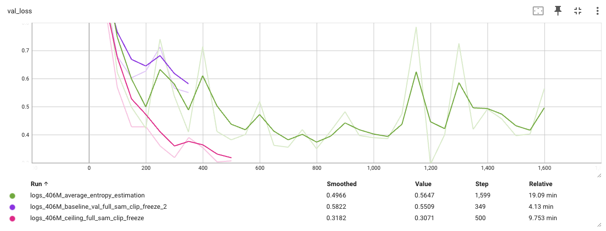
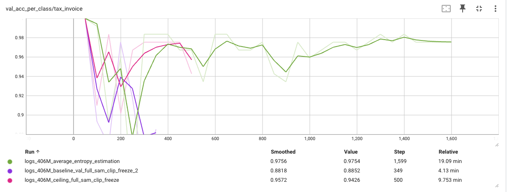
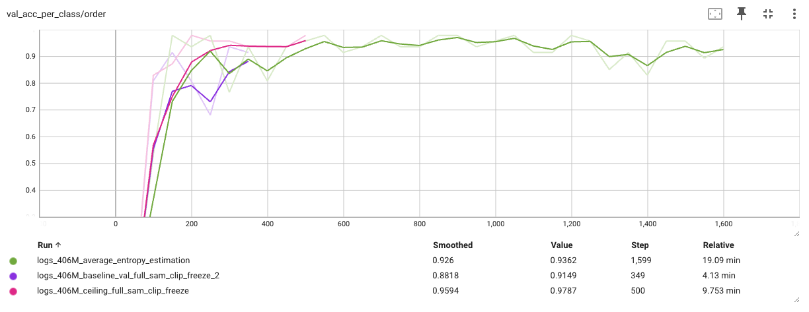
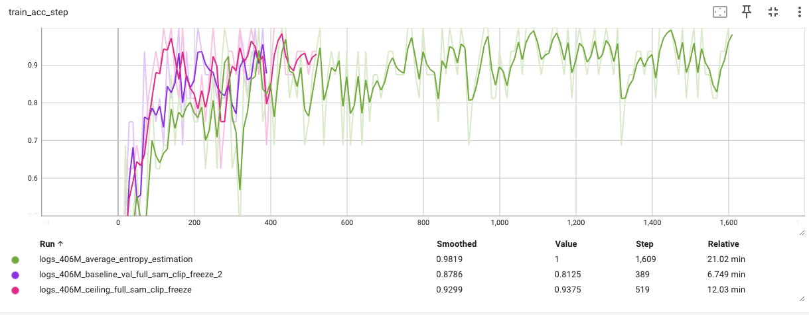
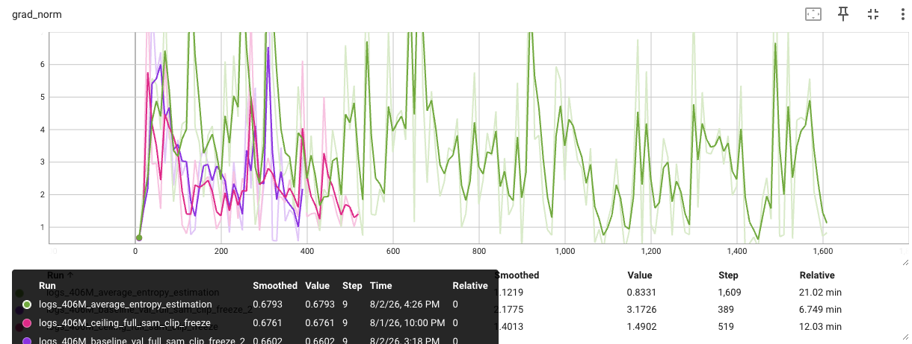

# Uncertainty estimation

This entire experiment is aimed at finding the answer to the question: “From a given pool of unlabeled data, how would you select a subset to annotate so that they can help your model become better?”

Gtihub repo : https://github.com/nishantb06/uncertainity_estimation

## Protocol

We work with 5680 DocILE documents. Following the assignment remap, the original validation set (500) is the labeled seed, and the original training set (5180) is the unlabeled pool.

From the pool I carved out a fixed stratified holdout of 180 documents for evaluation, dropped `debit_note` and `utility_bill` (absent from val), and left ~4982 documents as the selectable pool. All reported metrics are on this holdout.

The three training runs are:

1. **Baseline** — train on the 500 labeled seed only.
2. **Selected** — train on the 500 + 1500 documents chosen from the pool without using their labels at selection time.
3. **Ceiling** — train on the full pool ∪ seed. This sets an upper bound; 500 + 1500 should beat baseline but not beat ceiling.

## Experiments setup

### Infrastructure

I train on AWS spot instances (G6) machines and I keep one EBS volume which gets reattached and mounted to every new machine. This way all my checkpoints and logs persist across all the training sessions.

### Model

Every recent SOTA document understanding / OCR model has a two-phase pipeline: a ~500M vision encoder that produces token embeddings for an LLM decoder. Keeping the visual token count small matters, since 16×16 patches explode context length.

I used DeepSeek’s vision encoder: an 80M SAM encoder, a convolution downscale, then a 300M CLIP model that outputs 64 / 100 / 256 tokens at 512 / 640 / 1024. I freeze SAM and CLIP, and attach a custom MLP on CLIP’s CLS token for 7-way document-type classification (page 0 only, train resolution 640).

Tax invoice and order dominate the class distribution (~68% / ~25%), so I only include holdout curves for those two.

## Methods for uncertainty estimation

I scored the unlabeled pool with the baseline checkpoint. Let $z \in \mathbb{R}^{C}$ be the MLP logits over $C = 7$ classes, and

$$
p_c = \frac{e^{z_c}}{\sum_{k=1}^{C} e^{z_k}}, \qquad
H(p) = -\sum_{c=1}^{C} p_c \log p_c
$$

(natural log / nats). High $H(p)$ means the model cannot classify the document clearly, so annotating it is more likely to provide useful training signal.

The main selection rule was **average entropy**. For resolutions $r \in \{512, 640, 1024\}$ with logits $z^{(r)}$,

$$
\bar{z} = \frac{1}{3}\sum_{r} z^{(r)}, \qquad
s_{\mathrm{ent}} = H\!\left(\mathrm{softmax}(\bar{z})\right)
$$

(`entropy_mean_logits`). I rank the pool by $s_{\mathrm{ent}}$ and take the top 1500.

The same multi-resolution setup also supports other scores I implemented (not used for the plots below):

1. Per-resolution entropy $H(p^{(r)})$ — high on all three, or extremely high on one.
2. Jensen–Shannon divergence across resolution pairs. For distributions $p, q$:

$$
\mathrm{JSD}(p \| q) = \tfrac{1}{2}\, D_{\mathrm{KL}}(p \| m) + \tfrac{1}{2}\, D_{\mathrm{KL}}(q \| m),
\quad m = \tfrac{1}{2}(p + q)
$$

3. Ghost-gradient uncertainty: for head-gradient directions $g^{(r)}$ at each resolution, score disagreement as

$$
s_{\mathrm{ghost}} = 1 - \frac{1}{|\mathcal{P}|}\sum_{(r,r') \in \mathcal{P}}
\cos\!\left(g^{(r)}, g^{(r')}\right)
$$

where $\mathcal{P}$ is the set of resolution pairs.

Multi-checkpoint aggregation is another natural extension I did not run for the final comparison.

## Results

Using average-entropy selection, the 500 + 1500 model outperforms the baseline (500 only) on holdout loss and per-class accuracy for tax invoice and order, but does not beat the ceiling. Runs are not length-matched, so compare the curves with that in mind.

## Limitations

A random 1500 baseline would make clearer that the gain comes from *which* documents were chosen, not only from adding 1500 labels. Given more time, I would also try the same selection idea on an object-detection loss, and compare JSD / ghost selection head-to-head with entropy.
